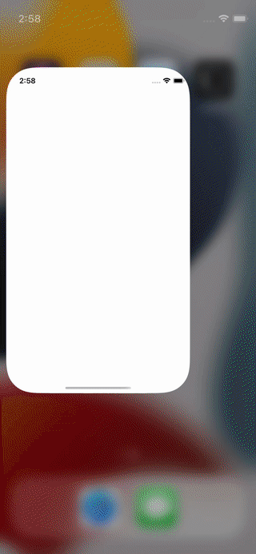

# GameCenterUI

The easiest way to integrate GameCenter with SwiftUI.

## Description

GameCenterUI enables use of Apple's GameKit framework from SwiftUI. Both iOS and Mac are supported.

## Demo



## Usage

Call `.enableGameCenter()` inside the `App` struct to authenticate with GameCenter.

```swift
import SwiftUI
import GameCenterUI

@main
struct MyApp: App {
    var body: some Scene {
        WindowGroup {
            ContentView()
                .enableGameCenter()
        }
    }
}
```

A view showing the highscore in a button that
presets the leaderboard if authenticated.
When not authenticated the button will take the
user to the preferences where one can log in to GameCenter.

```swift
struct MyGameView: View {
    @Binding var highscore: Int

    @Environment(\.gameCenterIsAuthenticated) var gameCenterIsAuthenticated
    @State var showGameCenter = false
    
    var body: some View {
        if gameCenterIsAuthenticated {
            Button("Highscore \(highscore)") {
                showGameCenter.toggle()
            }
            .gameCenter(
                isPresented: $showGameCenter,
                launchOption: .leaderBoardID(
                    id: "SomeLeaderboardID",
                    playerScope: .global,
                    timeScope: .allTime))
        } else {
            Button("Log in to game center") {
                openGameCenterConfiguration()
            }
        }
    }
}
```

## Installation

### Package.swift

Edit the Package.swift file. Add the GamCenterUI as a dependency:
 
```
let package = Package(
    name: " ... ",
    products: [ ... ],
    dependencies: [
        .package(url: "https://github.com/berikv/GameCenterUI.git", from: "1.0.0") // here
    ],
    targets: [
        .target(
            name: " ... ",
            dependencies: [
                "GameCenterUI" // and here
            ]),
    ]
)
```

### For .xcodeproj projects

1. Open menu File > Add Packages...
2. Search for "https://github.com/berikv/GameCenterUI.git" and click Add Package.
3. Open your project file, select your target in "Targets".
4. Open Dependencies
5. Click the + sign
6. Add GameCenterUI
